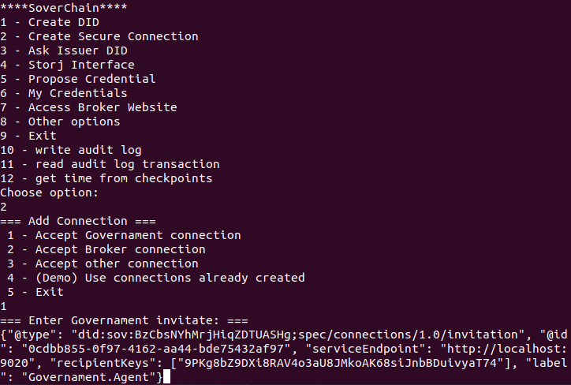

# SoverChain: Self-Sovereign Identity Management System

In this work, it is proposed SoverChain, a self-sovereign identity (SSI) management system, providing ownership and control of identity back to the users and preventing abuses of system providers. SoverChain aims to consolidate the most desirable characteristics of existing SSI systems while introducing novel enhancements to further improve upon these systems. Our approach builds on specific technologies to provide transparency, availability, security, privacy, interoperability, and decentralization by leveraging: blockchain technology for the creation of digital identities and storage of audit logs, Storj is a decentralized file storage system to securely store users' identity documents, and the employment of Hyperledger projects such as Indy, Ursa, and Aries, which provide a toolkit for management of verifiable digital credentials.

## Getting Started

These instructions will get you a copy of the project up and running on your Linux machine for development and testing purposes.

### Prerequisites:

Make sure you have the following software installed on your system:

- Git (minimum version 2.0)
- Docker (minimum version 20.0)
- Python (minimum version 3.0)
- Flask (minimum version 2.0)

Here are the commands you can use to verify the versions:

```
git --version
docker --version
python3 --version
flask --version
```

### Installing:

If prerequisites are not installed or outdated, use the following commands to install:

```
sudo apt update
sudo apt-get install git
sudo apt install docker.io
sudo apt install python3-pip
```

Additionally, you also need to install the following technologies in your Linux machine:

1. Install libindy and indy-cli:

```
sudo apt-key adv --keyserver keyserver.ubuntu.com --recv-keys CE7709D068DB5E88
sudo apt install software-properties-common
sudo apt-add-repository "deb https://repo.sovrin.org/sdk/deb bionic master" -y
sudo apt-get update
sudo apt-get install -y indy-cli
```

2. Install python3-indy:

```
pip3 install python3-indy
```

3. Install aries-cloudagent:

```
pip3 install aries-cloudagent
```

4. Install Cryptography and Ursa library:
```
pip3 install cryptography
pip install ursa-bbs-signatures
```


# Deployment

## Steps 1 to 4 only need to be executed one time:

1. First, we need to get download the code:
https://anonymous.4open.science/r/SoverChain-A17B/README.md

2. We need to run our local Indy Ledger with von network, by running the following commands.

```
cd von_network
sudo ./manage build
sudo ./manage start
```

3. Before starting our agents we need to register them in indy ledger by acessing: http://localhost:9000/
and register each of the following seeds, as shown in picture below and pressing "Register DID":
```
000000000000000000000000Stewar31
000000000000000000000000Stewar32
000000000000000000000000Stewar33
```


4. Connect our Storj account to SoverChain prototype.

Access Storj site https://www.storj.io/ and create or login with our test account in zone EU1:

```
t73848286@gmail.com
Password: TestUser123456789.
```

Go to "QuickStart" option on left toolbar and select "Upload using CLI" and keep pressing "Continue" until API key Generated are created.

Now, use the following commands to setup Storj with those keys:

```
unzip -o uplink_linux_amd64.zip
sudo install uplink /usr/local/bin/uplink
uplink setup
```

Aftewards provide the name of the project, API key, Satellite address, the user password and answer "y" to the follow up questions.

```
API key: 1dfJKJPmCsJjrpj7s6tmG7EGsMgenxprUMD6XHhNxGVLjAPpf8Qs2LNcy7Tj4BEwwv9atTmTwTYirKf3hBut8XCJSo1dAwXh5zA3GjydLNYE3PGyyBNS

Satellite address:
12L9ZFwhzVpuEKMUNUqkaTLGzwY9G24tbiigLiXpmZWKwmcNDDs@eu1.storj.io:7777

Password:
TestUser123456789.
```


Now SoverChain is ready to interact with your SoverChain account.
Inside SoverChain do not forget to create a bucket before uploading a file to Storj.


## Start SoverCahin:

5. Run each agent in a different terminal, User, Governament(Issuer) and Broker(Service provider):

```
cd project_localhost
python3 governament.py
python3 user.py
python3 broker.py
```

6. You are ready to start interacting from the User terminal with SoverChain!


# DEMO

Follow the example below to run a demo of SoverChain.
In this demo, the User will ask the government(Issuer) for a credential representing proof of residency, which the financial broker(Service provider) will request to the user to access its resources.

1. First, the user will establish a secure connection with the government(issuer) and with the financial broker.

Government creates a new invitation:


User accepts connection from governament:



An identical process occurs between the user and the service provider.

2. User uploads residence certificate to storj and gets the correspondent url.

In Storj Interface, upload a file from "images/" folder:


Get url from the uploaded file:


3. User ask for government(issuer) non-public DID:


4. User ask for a new credential with uploaded file.

User chooses option 4 "Propose credential", providing issuer DID and file url:


Government validates the credential and the uploaded identity document in Storj. Afterward, the government sends a credential offer to the user:


The user receives the issued credential and stores it in their wallet:


5. The user will send a verifiable presentation, requested by the financial broker website, using its credential.

The user accesses the website with option 7, "Access Website", and receives a verifiable presentation request:


The user chooses a credential to create the correspondent verifiable presentation:


The financial broker verifies the presentation and then responds to the user:


## Running Locust tests

To run the tests made

```
cd project_localhost/graphs
locust -f my_locust_file.py
```

Access http://0.0.0.0:8089/
Provide:
- Number of users
- Spawn rate
- Host: http://localhost:8006/


### Running Pyhton Latency test

1. To measure the latency of each functionality of SoverChain, go to user.py and change the value of variable timers to True.

2. Run a functionality of SoverChain(e.g: propose a credential). Select option 12 and provide the initial time measured as well as the final time measured. By subtracting these two values, you will determine the duration of the operation analyzed.


## Built With

* [Aca-py](https://github.com/hyperledger/aries-cloudagent-python) - A python implementation of the Aries Cloud Agent
* [Von Network](https://github.com/bcgov/von-network) - Indy Ledger
* [Flask](https://flask.palletsprojects.com/en/2.3.x/) - Pyhton framework
* [Hyperledger Aries](https://www.hyperledger.org/use/aries) - Verifiable digital credential tool kit
* [Hyperledger Indy](https://www.hyperledger.org/use/hyperledger-indy) - Ledger with digital identity tools
* [Hyperledger Ursa](https://www.hyperledger.org/use/ursa) - Cryptographic library


## Authors

Anonymous

## License

This project is licensed under the MIT License - see the [LICENSE.md](LICENSE.md) file for details


